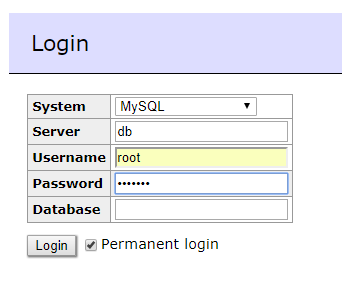
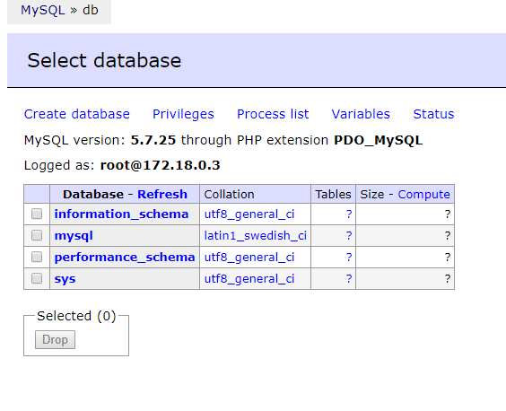

# Creating Networks

## Objective

* Create a new network
* Launch a MySQL container and add it to the network that was created
* Launch an Adminer container and add it to the network that was created
* Verify that the two containers can communicate together via the network

## To-do

* Run `docker network create mysqlnet` on your terminal.
    * This command will create a new network called `mysqlnet`.
* Run `docker network ls` on your terminal.
    * Make sure the `mysqlnet` network is on the list.
* Run `docker run --name mysql-server -e MYSQL_ROOT_PASSWORD=hunter2 -d mysql:5.7.25` on your terminal.
    * The `:5.7.25` specifies the version of the image we want to use.
    * The `-e` option will set an environment variable on the container with the supplied key/value pair.
    * Note how we don't expose a port here at all.
* Run `docker run --name adminer -p 8080:8080 adminer -d` on your terminal
* At this point, we should have adminer running at `http://localhost:8080/`, but nowhere it can connect to. We can verify this with `docker ps` and by using a browser to check adminer works.
* Note that trying to login to the MySQL server via adminer using `db` as the server, `root` as the user, and `hunter2` as the password does not work at this point.
* Run `docker network connect --alias db mysqlnet mysql-server`.
    * This will connect the container named `mysql-server` to the network named `mysqlnet` with a network alias of `db`.
    * Other containers can use the network alias we define here to connect to the container as long as they belong to the same network.
* Run `docker network connect mysqlnet adminer`.
    * Again here, we connect the adminer container to the same network as the mysql server. This time we don't care about the alias as the adminer is a client and not a server.
* We can use `docker network inspect mysqlnet` to check what containers have been connected to the network.
* Finally, using the server `db`, user `root`, and password `hunter2`, we should be able to log in to the MySQL server via adminer's web interface.
* Stop the containers and remove the network: `docker stop adminer mysql-server && docker network rm mysqlnet`

## Expected output

```
$ docker network create mysqlnet
f759c84ea431a166fad705536c06b576e39e7e0c6ffe1a03193eb4944a54a076
```

```
$ docker network ls
NETWORK ID          NAME                DRIVER              SCOPE
5ecabd28bd75        bridge              bridge              local
f21fb02255ca        host                host                local
f759c84ea431        mysqlnet            bridge              local
5031babbccf4        none                null                local
```

```
$ docker run --name mysql-server -e MYSQL_ROOT_PASSWORD=hunter2 -d mysql:5.7.25
71a8842baf9936dffda32b61ebfa7f7217c66fafefc5de18d96453d63c520737
```

```
$ docker run --name adminer -p 8080:8080 -d adminer
d66e21e269a1ce5e800fa0ca995219b06ad34cc55e8701f2054a912ae25dd8d5
```

```
$ docker ps
CONTAINER ID        IMAGE               COMMAND                  CREATED             STATUS              PORTS                    NAMES
d66e21e269a1        adminer             "entrypoint.sh docke…"   5 seconds ago       Up 4 seconds        0.0.0.0:8080->8080/tcp   adminer
70c077d51f52        mysql               "docker-entrypoint.s…"   48 seconds ago      Up 46 seconds       3306/tcp, 33060/tcp      mysql-server
```

```
$ curl localhost:8080
  % Total    % Received % Xferd  Average Speed   Time    Time     Time  Current
                                 Dload  Upload   Total   Spent    Left  Speed
  0     0    0     0    0     0      0      0 --:--:-- --:--:-- --:--:--     0<!DOCTYPE html>
<html lang="en" dir="ltr">
<meta http-equiv="Content-Type" content="text/html; charset=utf-8">
<meta name="robots" content="noindex">
<title>Login - Adminer</title>
<link rel="stylesheet" type="text/css" href="?file=default.css&amp;version=4.7.0">
<script src='?file=functions.js&amp;version=4.7.0' nonce="Y2IwZTg0MzU2NjM3NzkyM2JiYWU5ZjEwZjE2MDVhZGY="></script>
<link rel="shortcut icon" type="image/x-icon" href="?file=favicon.ico&amp;version=4.7.0">
<link rel="apple-touch-icon" href="?file=favicon.ico&amp;version=4.7.0">

<body class="ltr nojs">
<script nonce="Y2IwZTg0MzU2NjM3NzkyM2JiYWU5ZjEwZjE2MDVhZGY=">
mixin(document.body, {onkeydown: bodyKeydown, onclick: bodyClick, onload: partial(verifyVersion, '4.7.0', '?', '579228:571606')});
document.body.className = document.body.className.replace(/ nojs/, ' js');
var offlineMessage = 'You are offline.';
var thousandsSeparator = ',';
</script>

<div id="help" class="jush-sql jsonly hidden"></div>
<script nonce="Y2IwZTg0MzU2NjM3NzkyM2JiYWU5ZjEwZjE2MDVhZGY=">mixin(qs('#help'), {onmouseover: function () { helpOpen = 1; }, onmouseout: helpMouseout});</script>

<div id="content">
<h2>Login</h2>
<div id='ajaxstatus' class='jsonly hidden'></div>
<form action='' method='post'>
<div></div>
<table cellspacing='0' class='layout'>
<tr><th>System<td><select name='auth[driver]'><option value="server" selected>MySQL<option value="sqlite">SQLite 3<option value="sqlite2">SQLite 2<option value="pgsql">PostgreSQL<option value="oracle">Oracle (beta)<option value="mssql">MS SQL (beta)<option value="firebird">Firebird (alpha)<option value="simpledb">SimpleDB<option value="mongo">MongoDB<option value="elastic">Elasticsearch (beta)<option value="clickhouse">ClickHouse (alpha)</select>
<tr><th>Server<td><input name="auth[server]" value="db" title="hostname[:port]" placeholder="localhost" autocapitalize="off">
<tr><th>Username<td><input name="auth[username]" id="username" value="" autocapitalize="off"><script nonce="Y2IwZTg0MzU2NjM3NzkyM2JiYWU5ZjEwZjE2MDVhZGY=">focus(qs('#username'));</script>
<tr><th>Password<td><input type="password" name="auth[password]">
<tr><th>Database<td><input name="auth[db]" value="" autocapitalize="off">
</table>
<p><input type='submit' value='Login'>
<label><input type='checkbox' name='auth[permanent]' value='1'>Permanent login</label>
</form>
</div>

<form action='' method='post'>
<div id='lang'>Language: <select name='lang'><option value="en" selected>English<option value="ar">???????<option value="bg">?????????<option value="bn">?????<option value="bs">Bosanski<option value="ca">Català<option value="cs">Ceština<option value="da">Dansk<option value="de">Deutsch<option value="el">????????<option value="es">Español<option value="et">Eesti<option value="fa">?????<option value="fi">Suomi<option value="fr">Français<option value="gl">Galego<option value="he">?????<option value="hu">Magyar<option value="id">Bahasa Indonesia<option value="it">Italiano<option value="ja">???<option value="ka">???????<option value="ko">???<option value="lt">Lietuviu<option value="ms">Bahasa Melayu<option value="nl">Nederlands<option value="no">Norsk<option value="pl">Polski<option value="pt">Português<option value="pt-br">Português (Brazil)<option value="ro">Limba Româna<option value="ru">???????<option value="sk">Slovencina<option value="sl">Slovenski<option value="sr">??????<option value="ta">??????<option value="th">???????<option value="tr">Türkçe<option value="uk">??????????<option value="vi">Ti?ng Vi?t<option value="zh">????<option value="zh-tw">????</select><script nonce="Y2IwZTg0MzU2NjM3NzkyM2JiYWU5ZjEwZjE2MDVhZGY=">qsl('select').onchange = function () { this.form.submit(); };</script> <input type='submit' value='Use' class='hidden'>
<input type='hidden' name='token' value='398440:424482'>
</div>
</form>
<div id="menu">
<h1>
100  4341    0  4341    0     0  92361      0 --:--:-- --:--:-- --:--:-- 92361ss="version">4.7.0</span>cla
<a href="https://www.adminer.org/#download" target="_blank" rel="noreferrer noopener" id="version"></a>
</h1>
</div>
<script nonce="Y2IwZTg0MzU2NjM3NzkyM2JiYWU5ZjEwZjE2MDVhZGY=">setupSubmitHighlight(document);</script>
```

```
$ docker network connect --alias db mysqlnet mysql-server
```

```
$ docker network connect mysqlnet adminer
```

```
$ docker network inspect mysqlnet
[
    {
        "Name": "mysqlnet",
        "Id": "f759c84ea431a166fad705536c06b576e39e7e0c6ffe1a03193eb4944a54a076",
        "Created": "2019-02-13T05:29:21.5502996Z",
        "Scope": "local",
        "Driver": "bridge",
        "EnableIPv6": false,
        "IPAM": {
            "Driver": "default",
            "Options": {},
            "Config": [
                {
                    "Subnet": "172.18.0.0/16",
                    "Gateway": "172.18.0.1"
                }
            ]
        },
        "Internal": false,
        "Attachable": false,
        "Ingress": false,
        "ConfigFrom": {
            "Network": ""
        },
        "ConfigOnly": false,
        "Containers": {
            "70c077d51f52bf03aff72fead79184204e1b620fa6531bf803021a26e14643b1": {
                "Name": "mysql-server",
                "EndpointID": "dbce9cfc72cf7fe0e684378d3e3107d0bcaf6a3cb884ab2e44fc40e1caeb93f7",
                "MacAddress": "02:42:ac:12:00:02",
                "IPv4Address": "172.18.0.2/16",
                "IPv6Address": ""
            },
            "d66e21e269a1ce5e800fa0ca995219b06ad34cc55e8701f2054a912ae25dd8d5": {
                "Name": "adminer",
                "EndpointID": "a413cd581e97b8cdab2733b857f1c2ff764d326864b89040c8ac2905a010f6d5",
                "MacAddress": "02:42:ac:12:00:03",
                "IPv4Address": "172.18.0.3/16",
                "IPv6Address": ""
            }
        },
        "Options": {},
        "Labels": {}
    }
]
```





```
$ docker stop adminer mysql-server && docker network rm mysqlnet
adminer
mysql-server
mysqlnet
```

## Up next

[06 - Persistent Storage](../06-PersistentStorage/README.md)
